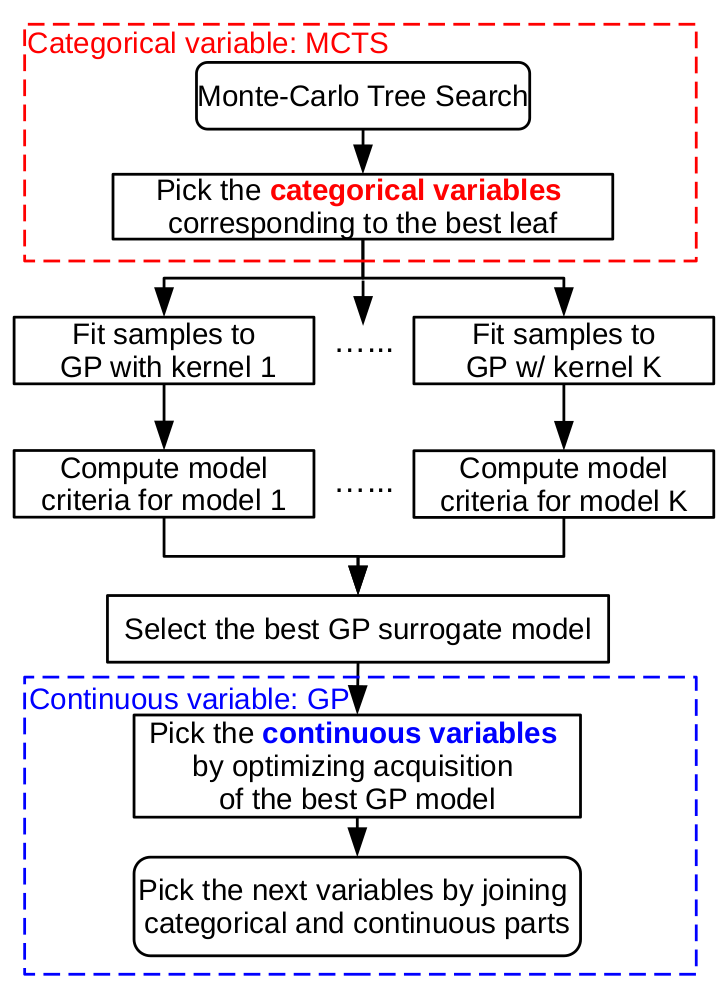

# hybridMinimization: Monte Carlo Tree Search (MCTS) and Gaussian process (GP) hybrid models for mixed variable surrogate modeling

## **Content**

This is the code repository for the research publication "Hybrid Models for Mixed Variables in
Bayesian Optimization" by [Hengrui Luo](https://hrluo.github.io/), [James W. Demmel](http://people.eecs.berkeley.edu/~demmel/), [Younghyun Cho](https://github.com/younghyunc), [Xiaoye S. Li](https://crd.lbl.gov/departments/applied-mathematics/scalable-solvers/members/staff-members/xiaoye-li/) and [Yang Liu](https://crd.lbl.gov/departments/applied-mathematics/scalable-solvers/members/staff-members/yang-liu/). 
The manuscript of this paper can be accessed at 

Below we describe the files in the folder for your reference.

### What is a hybrid model?
- **GP + MCTS hybrid (surrogate) model**  
    - Hybrid models refer to the collection of architecture where Monte Carlo Tree Search (MCTS) Gaussian process(GP)-based (surrogate)  model that attempts to address potential non-smoothness in black-box functions.
        - MCTS is developed to handle the search of categorical variables, supporting both UCTS and Bayesian strategies.
        - GP is derived for the search of continuous variables, and also modeling the overall surrogate for both continuous and categorical variables.
        - At a high level, our work could be summarized as **MCTS+shared GP**. 

    - Hybrid model generalizes several mixed-variable surrogate models. It is also inspired by several state-of-the-art mixed-variable methods. (Especially, `CoCaBO`**(MAB+shared GP)** and `Mozaic`**(MCTS+independent GP)** )

    - Hybrid model introduces novel dynamic model selection among a wide range of new kernel families to improve the performance among different kinds of benchmarks. We pointed out that both stationary and non-stationary should be taken into consideration, and model selection in the online context is of practical importance. 
        - This differentiates our method from **all** the stat-of-the-art mixed variable methods, which come with fixed modeling strategy. 

- **Motivation.** Simple GP surrogate model cannot model variables that are not continuous, excluding both integer and categorical variables. For example, categorical variables can determine types of algorithms in tuning; or function regime in black-box functions. A function of this kind would be $f(x_1,x_2)=\sin(x_1)\cdot 1(x_2=0)+\exp(x_1)\cdot 1(x_2=1)$, where $x_1$ is a continuous variable on real line, and $x_2$ is a categorical variable taking categories encoded by $0,1$.
The scheme below shows how hybrid model handles both the continuous and categorical variables. 




- **Advantages.** There are several advantages that hybrid models has over GP as surrogate:


    - ***Dynamic model selection with novel kernels.*** We develop novel families of kernels as well as model selection criteria that are specifically designed for the Bayesian online optimization purpose. 

    - ***Memory-efficient.*** MCTS can search the categorical variable space very efficiently with minimal memory usage. And the GP structure is preserved for better understanding in the behavior of black-box functions. 

    - ***Flexibility.*** The hybrid model implements both classic and Bayesian strategies for MCTS. It also supports historical data loading, hence allow us to transfer previous knowledge for optimization. This also unfied several previous mixed-variable models. 


- **Implementation.** The hybridMinimization is implemented within the python framework in a flexible way:

    - hybridMinimization can be used alone as a surrogate model and it is built on python, compatible with scikit-learn/scipy format.
Computation
    - hybridMinimization also has natural computational advantage when handling many categories. Instead of generating a full search tree, hybridMinimization naturally .
## **Usage**
On the commandline, our model can be executed using the following lines:
```
python driver.py test_NNregression_ord
```
where the `test_NNregression_ord.py` contains the definition of the black-box function as well as parameter spaces, etc. However, we could also use the hybridMinimization in another script file or ipython notebook. 
The following is a typical usage of our hybridMinimization method:
```
from hybridMinimization import *

h1_y,h1_x,h1_root,h1_model,h1_model_history = hybridMinimization(fn=f_truth,\
                                        selection_criterion = 'custom',\
                                        fix_model = -1,\
                                        categorical_list=categorical_list,\
                                        categorical_trained_model=None,\
                                        policy_list=[hybridStrategy]*len(categorical_list),update_list=[hybridStrategy]*len(categorical_list),exploration_probability=0.10,\
                                        continuous_list=continuous_list,\
                                        continuous_trained_model=None,\
                                        observed_X = X0,\
                                        observed_Y = Y0,\
                                        n_find_tree=n_find_tree,\
                                        n_find_leaf=int(evaluationBudget/n_find_tree_iter),\
                                        node_optimize='GP-EI',\
                                        random_seed=randomSeed,\
                                        minimize=True,\
                                        N_initialize_leaf=0) 
```
Then, we can use the following code to store the objects:
```
pkl_dict = {'categorical_model':h1_root,'continuous_model':h1_model,'train_X':h1_x,'train_Y':h1_y,'model_history':h1_model_history,'continuous_list':continuous_list,'categorical_list':categorical_list}
```
#### **Model specific parameters**

These parameters control the behavior of the surrogate model and numerical stability, usually not data-dependent. 

The very first question we should ask is that: do we believe there are different regimes in the black-box function (either theoretically or empirically)? 
Under the limited budget, more pilot samples usually lead to a better fitted surrogate model. Fewer samples are needed if the signal-to-noise ratio of the black-box function is high; fewer samples are needed if the black-box function has few non-smooth points. Although with sufficient samples cGP and GP shows little difference (since the clustering scheme would essentially be smoothed out by sufficient samples), when the samples are limited each component of cGP would require more parameters to be fitted. In addition, cGP provides a informative partition of the domain.

- **fn** The black-box function that returns a value. This can be defined in the same file or imported. 

- **selection_criterion** The model selection criteria used in each sequential sampling step of the hybrid method. Currently we support: `custom` (our novel selection criteria) `loglik` (log likelihood of the joint GP model), `AIC` (Akaike information criteria), `BIC` (Bayesian information criteria), `HQC` (Hannan–Quinn information criterion).

- **fix_model** This is a debug option that allows us to over-ride the selection criteria, please refer to the source code if you want to change this option. 

- **categorical_list** This is the cateogrical variable list. For instance, we can input a list `[[0,1,2],[0,1,2,3,4]]`, this means that there are two categorical variables, corresponding to the 1st and 2nd layers of the MCTS. Then, the first categorical variable/layer can be chosen from [0,1,2]; and the second categorical variable/layer can be chosen from [0,1,2,3,4]. The ordering of the layer is also expressed in this list. 

- **categorical_trained_model** This allows us to load a trained MCTS (with possible pre-trained weights) for the categorical part into the minimization. Therefore, if we have some trained model from historical data, it would be loaded and assist the transfer learning in sequential sampling step. By default it is `None` meaning that there would be no prior tree model.

How often should the sequential sampling procedure use a random sampling scheme? Sometimes the random sampling, instead of surrogate model guided sampling (i.e. via acquisition function maximization), would accelerate the exploration of the domain. This allows faster exploration over the input domain, especially for wiggly black-box function $f$.

- **policy_list** This expresses the MCTS search policy of each layer of the tree structure. Currently it supports `UCTS` (UCB),`UCTS_var` (UCB with variance modification),`EXP3` (EXP3),'Multinomial' (Bayesian strategy, detailed in our paper). Note that a typical list could look like 
`['UCTS','EXP3']`, meaning that we assign different strategies for different layers in the MCTS. 
- **update_list** This expresses the MCTS node weight update strategy of each layer of the tree structure. This usually should match the searching strategy expressed in the `policy_list`.

- **exploration_probability** This is the $\varepsilon$ random search probability when the MCTS decides not to roll out a heuristic choice but a random choice. 

- **continuous_list** This is the continuous variable bounds. For instance, we can input a list `[[0,1],[-4,4]]`, this means that there are two continuous variables, where the first continuous variable can be chosen from the range interval [0,1]; and the second continuous variable can be chosen from the range interval [-4,4]. There is no ordering of continuous variables, in this list. 

- **continuous_trained_model** This allows us to load a trained GP (with possible pre-trained parameters) for the continuous part into the minimization. Therefore, if we have some trained model from historical data, it would be loaded and assist the transfer learning in sequential sampling step. By default it is `None` meaning that there would be no prior GP model.

- **observed_X** This $n\times d$ matrix that specifies the $X$ (input locations) in the already observed data that can be provided in addition to the sequential samplings. This could also be considered as pilot samples that is guided by some optimal design or sampling schemes. 

- **observed_Y** This $n\times 1$ matrix that specifies the $Y$ (input responses) in the already observed data, corresponding to the locations in `observed_X`.

- **Budget parameters** refer to the *n_find_tree* and *n_find_leaf*. For the total *n_find_tree* searches along the tree structure, we search *n_find_leaf* continuous variable but fixed the categorical variables corresponding to that leaf. 
    - n_find_tree: number of searches allowed when trasversing the tree, i.e., how many categorical combinations we can afford to search. i.e., budget for categorical variables.
    - n_find_leaf: number of sequential samples allowed when we reach leaf, i.e., how many continuous variables we're allowed to observe. i.e., batch size for continuous variables.

- **node_optimize** This is specifying the acquisition function used in the GP surrogate model for continuous variable. Currently we support `GP-EI` and `GP-UCB` combinations.

- **random_seed** This sets the random seed for reproducibility. 

- **minimize** This parameter can be set to `False`, which allows us to maximize the function instead of minimizing the black-box function. 

- **N_initialize_leaf** This is a debug option and by default set to 0, please refer to the source code if you want to change this option. 

## **References**

**Funding**
This research was supported by the Exascale Computing Project (17-SC-20-SC), a collaborative effort of the U.S. Department of Energy Office of Science and the National Nuclear Security Administration.
We used resources of the National Energy Research Scientific Computing Center (NERSC), a U.S. Department of Energy Office of Science User Facility operated under Contract No. DE-AC02-05CH11231.

Please also check our website for the application of [GPTune project](http://gptune.lbl.gov).

**Abstract**
 

**Citation**
We provided Python code for reproducible and experimental purposes under [LICENSE](https://github.com/gptune).
Please cite our paper using following BibTeX item:

    @article{luo_hybrid_2022,
        title = {Hybrid Models for Mixed Variables in Bayesian Optimization},
        journal = {In Preparation},
        author = {Luo, Hengrui and Cho, Younghyun and Demmel, James W. and Li, Xiaoye S. and Liu, Yang},
        year = {2022+},
        pages = {1--56}
    } 

Thank you again for the interest and please reach out if you have further questions.
